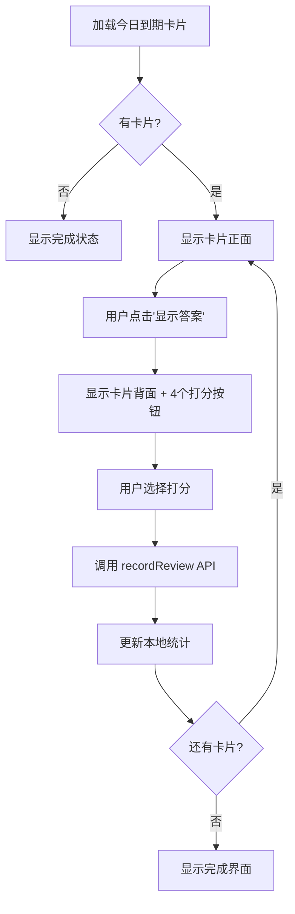

# W4-03 实现文档：复习队列与打分

## 📋 概述

**工单编号**: W4-03  
**优先级**: P0  
**状态**: ✅ 已完成  
**实施日期**: 2026-01-29

### 目标
实现 SRS 复习功能，将页面从 mock 数据迁移到真实数据库 API，集成 SM-2 算法进行智能间隔复习。

### 前置依赖
- ✅ W4-01: SRS 数据库架构和 API（`getDueCards`, `recordReview`）
- ✅ W4-02: SRS 收藏按钮集成

---

## 🎯 实现内容

### 1. 主要改动

#### 文件：[`app/(app)/srs/page.tsx`](../app/(app)/srs/page.tsx)

**从 Mock 数据迁移到真实 API：**
```typescript
// ❌ 旧代码（mock）
import { srsQueue, type SrsCard } from "@/lib/web-mock"
const [queue, setQueue] = useState(() =>
  srsQueue.filter((card) => card.due === "today")
)

// ✅ 新代码（真实 API）
import { getDueCards, recordReview } from "@/lib/srs/api"
import type { SRSCard, ReviewQuality } from "@/lib/srs/types"

useEffect(() => {
  loadDueCards()
}, [user, authLoading])

async function loadDueCards() {
  const cards = await getDueCards(50)
  setQueue(cards)
}
```

### 2. 数据结构映射

| Mock 数据 | 真实数据库 | 说明 |
|-----------|-----------|------|
| `word` | `content.front` | 卡片正面（问题） |
| `meaning` | `content.back` | 卡片背面（答案） |
| `pinyin` | `content.pinyin` | 拼音（可选） |
| `interval` | `interval` | 当前间隔天数 |
| `due: "today"` | `next_review <= now` | 到期判断 |
| - | `difficulty` | 难度等级（0=新卡片） |
| - | `ease_factor` | 难易度因子（2.5 默认） |

### 3. 打分系统（4 按钮）

从原来的 3 个按钮（Forgot/Hard/Good）改为 **4 个按钮**，与 SM-2 算法对齐：

| 按钮 | ReviewQuality | 文字 | 颜色 | 间隔预估 | 说明 |
|------|---------------|------|------|----------|------|
| Again | `0` | 不认识 | 红色 🔴 | < 1 天 | 完全不记得，重置间隔 |
| Hard | `2` | 模糊 | 橙色 🟠 | 较短 | 记得，但很困难 |
| Good | `3` | 认识 | 绿色 🟢 | 正常 | 记得，正常难度 |
| Easy | `5` | 简单 | 青色 🔵 | 较长 | 完全记得，非常容易 |

**间隔计算逻辑（显示预估）：**
```typescript
// Again (0): 重置为 < 1 天
<span>< 1天</span>

// Hard (2): 
difficulty === 0 ? "1天" : 
difficulty === 1 ? "1天" : 
Math.round(interval * 1.2) + "天"

// Good (3):
difficulty === 0 ? "1天" : 
difficulty === 1 ? "6天" : 
Math.round(interval * ease_factor) + "天"

// Easy (5):
difficulty === 0 ? "6天" : 
difficulty === 1 ? "10天" : 
Math.round(interval * ease_factor * 1.3) + "天"
```

### 4. 复习流程



### 5. API 集成

#### `getDueCards(limit?: number)`
- **功能**: 获取今日到期的卡片
- **调用时机**: 页面加载时、重置复习时
- **返回**: `SRSCard[]`
- **过滤条件**: `next_review <= now`

#### `recordReview(input: RecordReviewInput)`
- **功能**: 记录复习结果，更新卡片参数
- **调用时机**: 用户点击打分按钮
- **参数**:
  ```typescript
  {
    card_id: string,
    quality: ReviewQuality,  // 0, 2, 3, 5
    time_spent?: number      // 可选：用时（秒）
  }
  ```
- **返回**: `ReviewResult`（包含复习记录 + 更新后的卡片）
- **副作用**: 
  - 更新 `user_srs_cards` 表的 `next_review`, `interval`, `ease_factor` 等
  - 插入 `user_srs_reviews` 记录

---

## 🧪 测试验收

### 1. 功能验收步骤

#### 步骤 1：准备测试数据
```bash
# 确保 Supabase 已连接，并有测试卡片
# 可以通过 W4-02 的"加入 SRS"按钮添加卡片
```

#### 步骤 2：访问 SRS 页面
```bash
# 启动开发服务器（如果未运行）
npm run dev

# 浏览器访问
http://localhost:3000/srs
```

#### 步骤 3：验证核心功能
- ✅ **加载状态**: 页面显示"加载中..."
- ✅ **有卡片**: 显示卡片正面（`content.front`）
- ✅ **无卡片**: 显示"今日已完成！"
- ✅ **显示答案**: 点击后显示背面（`content.back` + `pinyin`）
- ✅ **4 个按钮**: Again / Hard / Good / Easy 全部显示
- ✅ **间隔预估**: 每个按钮下方显示预计间隔天数
- ✅ **打分**: 点击任意按钮后：
  - 调用 `recordReview` API
  - 统计数字实时更新（右侧面板）
  - 自动跳转到下一张卡片
- ✅ **完成**: 全部复习完成后显示统计摘要

#### 步骤 4：数据库验证
1. 访问 Supabase 控制台
2. 查看 `user_srs_reviews` 表
3. 验证每次复习都有记录：
   - `card_id` 正确
   - `quality` 为 0/2/3/5
   - `new_interval` 和 `new_ease_factor` 已计算
4. 查看 `user_srs_cards` 表
5. 验证卡片的 `next_review` 已更新到未来

#### 步骤 5：SM-2 算法验证
**测试场景**：复习同一张卡片多次，验证间隔变化

| 复习次数 | 打分 | 预期 next_review | 预期 interval |
|---------|------|-----------------|---------------|
| 1 | Good (3) | +1 天 | 1 |
| 2 | Good (3) | +6 天 | 6 |
| 3 | Good (3) | +15 天（约） | 15 |
| 如果 Again (0) | - | +1 天 | 1（重置） |

### 2. 错误处理验证
- ✅ **未登录**: 自动跳转到 `/login`
- ✅ **网络错误**: 显示错误信息，提供"重试"按钮
- ✅ **API 失败**: 显示具体错误消息

### 3. UI/UX 验证
- ✅ 进度条正确显示（如：5/20）
- ✅ 右侧统计面板实时更新
- ✅ 按钮禁用状态（复习中时）
- ✅ 加载动画流畅
- ✅ 完成界面显示正确率

---

## 📊 统计显示

### 本次统计（Session Stats）
- **不认识** (Again): 红色，计数
- **模糊** (Hard): 橙色，计数
- **认识** (Good): 绿色，计数
- **简单** (Easy): 青色，计数

### 进度（Progress）
- **今日剩余**: 未复习的卡片数
- **已完成**: 当前会话已复习的卡片数

### 完成界面
- **正确率**: `(Good + Easy) / Total * 100%`
- **4 个按钮统计**: 显示每个选项的计数

---

## 🔄 SM-2 算法集成

### 算法实现位置
[`lib/srs/api.ts`](../lib/srs/api.ts) 的 `calculateSM2()` 函数

### 算法参数
- **quality**: 0-5（本项目使用 0, 2, 3, 5）
- **interval**: 当前间隔天数
- **ease_factor**: 难易度因子（1.3 - 2.5+）
- **difficulty**: 难度等级（0 = 新卡片）

### 间隔计算规则
```typescript
if (quality < 3) {
  // Again 或 Hard: 重置间隔
  newInterval = 1
  newDifficulty = 0
} else {
  // Good 或 Easy: 增加间隔
  newDifficulty += 1
  
  if (newDifficulty === 1) newInterval = 1
  else if (newDifficulty === 2) newInterval = 6
  else newInterval = Math.round(interval * newEaseFactor)
}
```

---

## 🐛 已知限制

1. **时间戳精度**: 使用 `next_review <= now` 判断，可能存在时区问题（已使用 ISO 8601/UTC）
2. **队列管理**: 当前不支持动态添加新卡片到队列（需刷新页面）
3. **撤销功能**: 暂不支持撤销上一次复习

---

## 📝 后续优化建议

1. **添加撤销功能**: 允许用户撤销最近一次复习
2. **快捷键支持**: 使用键盘 1/2/3/4 快速打分
3. **音频播放**: 支持卡片音频（`content.audioUrl`）
4. **统计图表**: 集成 `getDailyReviewData()` 显示复习趋势
5. **分批加载**: 实现无限滚动或分页加载大量卡片

---

## ✅ 验收清单

- [x] 页面使用真实 API 加载数据
- [x] 4 个打分按钮正确显示
- [x] 点击打分调用 `recordReview()` API
- [x] 复习后 `next_review` 更新到数据库
- [x] 统计数字实时更新
- [x] 完成界面显示准确
- [x] 错误处理完善
- [x] 加载状态友好
- [x] TypeScript 类型安全

---

## 🎉 Commit Message

```
feat(srs): integrate real SRS API for review queue (W4-03)

- Replace mock data with getDueCards() API
- Update review buttons to 4 options (Again/Hard/Good/Easy)
- Integrate recordReview() to save review results with SM-2 algorithm
- Display real-time review stats and progress
- Implement queue management with database sync
- Add loading states and error handling
- Show interval estimates for each review option

Related: W4-01, W4-02
Closes: W4-03
```

---

## 📚 相关文档

- [W4-01 数据库架构](./W4-01-database-schema.sql)
- [W4-01 设置指南](./W4-01-setup-guide.md)
- [SRS API 文档](../lib/srs/api.ts)
- [SRS 类型定义](../lib/srs/types.ts)
- [SM-2 算法说明](https://www.supermemo.com/en/archives1990-2015/english/ol/sm2)
